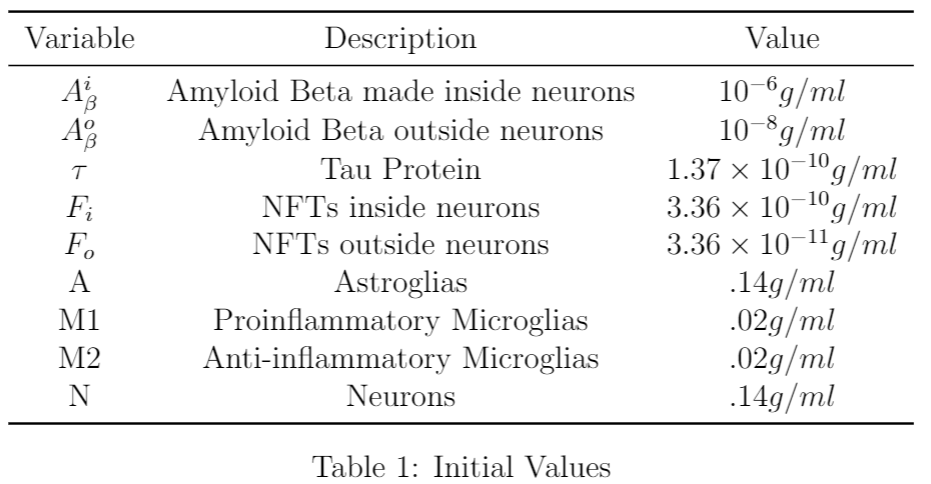
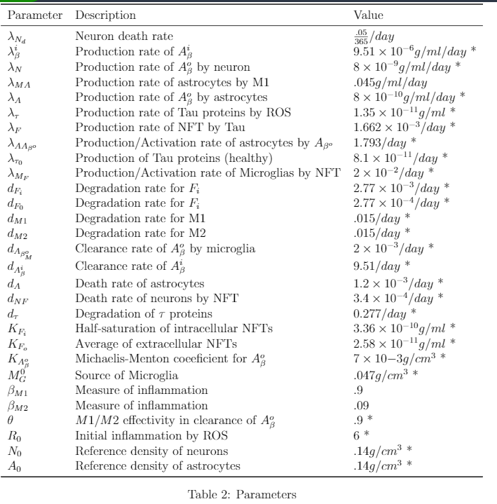

```{r setup, include=FALSE}
knitr::opts_chunk$set(echo = TRUE)
```

The code in this file runs a differential equation model for neuron death in patients with Alzheimer's Disease. It also includes sensitivity analysis, and simulations of two drug treaments. Each section of code is clearly separated so you can use only the parts you need.

The work is based on the following compartment model.


```{r include=FALSE}
# Library required packages
library(deSolve)
library(rootSolve)
```


The intial values and parameters are provided here in tables for ease of undersatanding





```{r}
###########################################################################################################
## Run the model and collect and plot the outputs
###########################################################################################################
##Set initial values
init.values=c(ABi=.000001,ABo=.00000001,Tau=1.37*10^(-10),Fi=3.36*10^(-10),
              Fo=3.36*10^(-11),A=.14,M1=.02,M2=.02, N=.14)
##set parameters
my.parms=c(lamdaBi=9.51*10^(-6),lamdaN=8*10^(-9),lamdaA=8*10^(-10),lamdaT=1.35*10^(-11),
           lamdaF=1.662*10^(-3),lamdaAABo=1.793,lamdaT0=8.1*10^(-11), MGo=.047,
           dABoM=2*10^(-3),degABi=9.51,lamdaNd=(.05/365), KABo=7*10^(-3),
           dT=.277, degFi=2.77*10^(-3),degFo=2.77*10^(-4),degM1=.015, degM2=.015,
           lamdaMF=2*10^(-2),KFo=2.58*10^(-11),KFi=3.36*10^(-10), BM1=.9,BM2=.09,
           degA=1.2*10^(-3),theta=.9,R0=6,N0=.14, A0=.14, degNF=3*10^(-4),
           lamdaMA=.045, lamdaTr=.8*10^(-11))
##Run for 10 years at one dat increments
outtimes=seq(1,3650,by=1)
#Run the model with the differential equations specified in the following function
ALmodel=function(t,y.values,parameters){
        with(as.list(c(y.values,parameters)),{
                
                R=ifelse(t<=100,R0*(t/100),R0)
                
                dN.dt=-degNF*(Fi/(Fi+KFi))*N ##Without effect of Tau-alpha
                
                dABi.dt=(lamdaBi*(1+R)-degABi*ABi)*N/N0   ##As is
                
                ## Without macrophage effect and estimating dN/dt
                ##LamdaNd was (.6*10^(-3))
                dABo.dt=ABi*lamdaNd+lamdaN*(N/N0)+lamdaA*A/A0-
                        (dABoM*(M1+theta*M2))*(ABo/(ABo+KABo)) 
                ## Reduce effect of Amyloidβ aggregation by a factor of h w/aducanumab
                ##dABo.dt=ABi*lamdaNd+lamdaN*(N/N0)+lamdaA*A/A0-
                ##        (dABoM*(M1+theta*M2)(1+h))*(ABo/(ABo+KABo))
                
                dA.dt=lamdaAABo*ABo+ lamdaMA*M1-degA*A ## Estimating Tau-alpha effect
                
                dTau.dt=(lamdaT0+lamdaT*R-dT*Tau)*(N/N0)   ##As is
                ## Simulate reduction in production of Tau by reducing GSK-3
                ## thereby reducing hyperphosphorylation
                ##dTau.dt=(lamdaT0+lamdaT-g)*R -g -dT*Tau)*(N/N0)   
                
                dFi.dt= (lamdaF*Tau-degFi*Fi)*(N/N0) ## As is
                
                
                dFo.dt= lamdaNd*Fi-degFo*Fo  ## estimating lamdaNd=dN/dt           
                
                
                dM1.dt=MGo*(lamdaMF*(Fo/(Fo+KFo)))*BM1-degM1*M1 ##No AO effect, estimate BM1
                
                dM2.dt=MGo*(lamdaMF*(Fo/(Fo+KFo)))*BM2-degM2*M2 ##No AO effect, estimate BM2
                
                return(list(c(dABi.dt,dABo.dt,dTau.dt,dFi.dt,dFo.dt,dA.dt,dM1.dt,dM2.dt, dN.dt)))
        })
}

## Collect the output in a data frame

output=as.data.frame(ode(func = ALmodel,y=init.values,parms = my.parms,times = outtimes))
```

Plot the results from running the model.

Neurons

```{r}
#Plot the output for number of neurons
par(mfrow=c(1,1))
matplot(output$time, output$N, xlab = "Time(days)", ylab = "Neurons (g/ml)", main="Concentration of Neurons", col="red")
```

Amyloid Beta


```{r}
#Amyloid Beta inside and outside the neuron
par(mfrow=c(1,2))
matplot(output$time, output$ABi, xlab = "Time(days)", ylab = "ABi (g/ml)", main="Concentration of AmyloidB \n Inside Neuron", col="blue")
matplot(output$time, output$ABo, ylim = c(0,1.1*10^(-6)), xlab = "Time(days)", ylab = "ABo (g/ml)", main="Concentration ofAmyloidB \n Outside Neuron ", col = "blue", lwd = 5)
```

Tau

```{r}
#Tau
matplot(output$time, output$Tau, xlab = "Time(days)", ylab = "Tau (g/ml)", main="Concentration of Tau", col = "darkred", lwd=5, type="l")
```

NFTs

```{r}
#NFTs
par(mfrow=c(1,2)) 
matplot(output$time, output$Fi, xlab = "Time(days)", ylab = "NFT (g/ml)", main="Concentration of NFTs\n Inside Neurons", lwd=5,type = "l")
matplot(output$time, output$Fo,  xlab = "Time(days)", ylab = "NFT (g/ml)", main="Concentration of NFTs\n Outside Neurons", lwd = 5,type = "l")
```

Astrocytes

```{r}
#Astrocytes
par(mfrow=c(1,1))
matplot(output$time, output$A,  xlab = "Time(days)", ylab = "Astrocytes (g/ml)", main="Concentration of Astrocytes", col = "darkgreen", lwd = 5)
```

Microglias

```{r}
#Microglias
par(mfrow=c(1,2))
matplot(output$time, output$M1,  xlab = "Time(days)", ylab = "Microglia (g/ml)", main="Concentration of \n Type 1 Microglia", col = "purple", lwd = 5)

matplot(output$time, output$M2,  xlab = "Time(days)", ylab = "Microglia (g/ml)", main="Concentration of \n Type 2 Microglia", col="purple", lwd = 5)
```

Sensitivity Analysis

Run a sensitivity analysis of the effects of lamdaN on Amyloid-beta and Neurons. We compare our original lamdaN=8*10^(-9), with lambdaN=4*10^(-9) and lamdaN=16*10^(-9). lamdaN is the effect of neurons on prodcution of amyloid-beta after neuron death. 

```{r}
#########################################################################################################
## Run sensitivity analysis on lamdaN
#########################################################################################################
my.parms=c(lamdaBi=9.51*10^(-6),lamdaN=8*10^(-9),lamdaA=8*10^(-10),lamdaT=1.35*10^(-11),
           lamdaF=1.662*10^(-3),lamdaAABo=1.793,lamdaT0=8.1*10^(-11), MGo=.047,
           dABoM=2*10^(-3),degABi=9.51,lamdaNd=(.05/365), KABo=7*10^(-3),
           dT=.277, degFi=2.77*10^(-3),degFo=2.77*10^(-4),degM1=.015, degM2=.015,
           lamdaMF=2*10^(-2),KFo=2.58*10^(-11),KFi=3.36*10^(-10), BM1=.9,BM2=.09,
           degA=1.2*10^(-3),theta=.9,R0=6,N0=.14, A0=.14, degNF=3*10^(-4),
           lamdaMA=.045)
init.values=c(ABi=.000001,ABo=.00000001,Tau=1.37*10^(-10),Fi=3.36*10^(-10),
              Fo=3.36*10^(-11),A=.14,M1=.02,M2=.02, N=.14)
outtimes=seq(1,3650,by=1)

vals=numeric(3)
vals[1]=4*10^(-9)   #1/2 the original value
vals[2]=8*10^(-9)   #original value
vals[3]=16*10^(-9)  #double the original value
i=1
par(mfrow=c(2,3))
sense.analysis=function(func,vals){
  for (i in 1:3) {
    my.parms=c(lamdaBi=9.51*10^(-7),lamdaN=vals[i],lamdaA=8*10^(-10),lamdaT=1.35*10^(-11),
               lamdaF=1.662*10^(-3),lamdaAABo=1.793,lamdaT0=8.1*10^(-11), MGo=.047,
               dABoM=2*10^(-3),degABi=9.51,lamdaNd=(.05/365), KABo=7*10^(-3),
               dT=.277, degFi=2.77*10^(-3),degFo=2.77*10^(-4),degM1=.015, degM2=.015,
               lamdaMF=2*10^(-2),KFo=2.58*10^(-11),KFi=3.36*10^(-10), BM1=.9,BM2=.09,
               degA=1.2*10^(-3),theta=.9,R0=6,N0=.14, A0=.14, degNF=3*10^(-4),
               lamdaMA=.045)
    output=as.data.frame(ode(func = ALmodel,y=init.values,parms = my.parms, times = outtimes))
    
    ## Plot the changes observed in amyloid-beta for each value in vals
    plot(output$time,output$ABo, ylim=c(0, 1.7*10^(-6)), xlab = "Time(days)", ylab = "ABo(g/ml)", col="blue" )
   
    
    i=i+1
  }
}

res=as.data.frame(sense.analysis(ALmodel,vals))

##Now the effect on neurons
i=1

sense.analysis=function(func,vals, plotvalue){
    for (i in 1:3) {
        my.parms=c(lamdaBi=9.51*10^(-7),lamdaN=vals[i],lamdaA=8*10^(-10),lamdaT=1.35*10^(-11),
                   lamdaF=1.662*10^(-3),lamdaAABo=1.793,lamdaT0=8.1*10^(-11), MGo=.047,
                   dABoM=2*10^(-3),degABi=9.51,lamdaNd=(.05/365), KABo=7*10^(-3),
                   dT=.277, degFi=2.77*10^(-3),degFo=2.77*10^(-4),degM1=.015, degM2=.015,
                   lamdaMF=2*10^(-2),KFo=2.58*10^(-11),KFi=3.36*10^(-10), BM1=.9,BM2=.09,
                   degA=1.2*10^(-3),theta=.9,R0=6,N0=.14, A0=.14, degNF=3*10^(-4),
                   lamdaMA=.045)
        output=as.data.frame(ode(func = ALmodel,y=init.values,parms = my.parms, times = outtimes))
        
        ##  ## Plot the changes observed in neurons for each value in vals
        plot(output$time,output$N, ylim = c(.075, .14), xlab="Time(days)",ylab = "Neurons(g/ml)" , col="red")
      
        i=i+1
    }
}


res2=as.data.frame(sense.analysis(ALmodel,vals, output$N))
```


Sensitivity of lamdaF on NFTs and Neurons
Now we perform a sensitivity analysis of the effects of lamdaF on NFTs and neurons. We use 1/2 the original value and double it.

```{r}
#########################################################################################################
## Run sensitivity analysis on lamdaF
#########################################################################################################

my.parms=c(lamdaBi=9.51*10^(-6),lamdaN=8*10^(-9),lamdaA=8*10^(-10),lamdaT=1.35*10^(-11),
           lamdaF=1.662*10^(-3),lamdaAABo=1.793,lamdaT0=8.1*10^(-11), MGo=.047,
           dABoM=2*10^(-3),degABi=9.51,lamdaNd=(.05/365), KABo=7*10^(-3),
           dT=.277, degFi=2.77*10^(-3),degFo=2.77*10^(-4),degM1=.015, degM2=.015,
           lamdaMF=2*10^(-2),KFo=2.58*10^(-11),KFi=3.36*10^(-10), BM1=.9,BM2=.09,
           degA=1.2*10^(-3),theta=.9,R0=6,N0=.14, A0=.14, degNF=3*10^(-4),
           lamdaMA=.045)
init.values=c(ABi=.000001,ABo=.00000001,Tau=1.37*10^(-10),Fi=3.36*10^(-10),
              Fo=3.36*10^(-11),A=.14,M1=.02,M2=.02, N=.14)
outtimes=seq(1,3650,by=1)
par(mfrow=c(2,3))

## Vary lamdaF 
vals=numeric(3)
vals[1]=8.31*10^(-4)       ## 1/2 the value
vals[2]=1.662*10^(-3)      ## Original value used for model
vals[3]=3.324*10^(-3)      ## 2x the value
i=1

##plot Fi for the three different lamda F values
sense.analysis=function(func,vals, plotvalue){
        for (i in 1:3) {
                my.parms=c(lamdaBi=9.51*10^(-7),lamdaN=8*10^(-9),lamdaA=8*10^(-10),lamdaT=1.35*10^(-11),
                           lamdaF=vals[i],lamdaAABo=1.793,lamdaT0=8.1*10^(-11), MGo=.047,
                           dABoM=2*10^(-3),degABi=9.51,lamdaNd=(.05/365), KABo=7*10^(-3),
                           dT=.277, degFi=2.77*10^(-3),degFo=2.77*10^(-4),degM1=.015, degM2=.015,
                           lamdaMF=2*10^(-2),KFo=2.58*10^(-11),KFi=3.36*10^(-10), BM1=.9,BM2=.09,
                           degA=1.2*10^(-3),theta=.9,R0=6,N0=.14, A0=.14, degNF=3*10^(-4),
                           lamdaMA=.045)
                output=as.data.frame(ode(func = ALmodel,y=init.values,parms = my.parms, times = outtimes))
               
                plot(output$time,output$Fi, ylim = c(1.5*10^(-10), 7*10^(-10)), xlab="Time(days)",ylab = "NFTs(g/ml)", lwd=5 )
                
                i=i+1
        }
}

res=as.data.frame(sense.analysis(ALmodel,vals, output$Fi))

## Rerun function to plot N

i=1

sense.analysis=function(func,vals, plotvalue){
        for (i in 1:3) {
                my.parms=c(lamdaBi=9.51*10^(-7),lamdaN=8*10^(-9),lamdaA=8*10^(-10),lamdaT=1.35*10^(-11),
                           lamdaF=vals[i],lamdaAABo=1.793,lamdaT0=8.1*10^(-11), MGo=.047,
                           dABoM=2*10^(-3),degABi=9.51,lamdaNd=(.05/365), KABo=7*10^(-3),
                           dT=.277, degFi=2.77*10^(-3),degFo=2.77*10^(-4),degM1=.015, degM2=.015,
                           lamdaMF=2*10^(-2),KFo=2.58*10^(-11),KFi=3.36*10^(-10), BM1=.9,BM2=.09,
                           degA=1.2*10^(-3),theta=.9,R0=6,N0=.14, A0=.14, degNF=3*10^(-4),
                           lamdaMA=.045)
                output=as.data.frame(ode(func = ALmodel,y=init.values,parms = my.parms, times = outtimes))
                
                plot(output$time,output$N, ylim = c(.065, .14), xlab="Time(days)",ylab = "Neurons(g/ml)", col="red", lwd=5 )
                
                i=i+1
        }
}

res2=as.data.frame(sense.analysis(ALmodel,vals, output$N))

```


Sensitivity of dNF on Neurons

```{r}
#########################################################################################################
## Run sensitivity analysis on degNF
#########################################################################################################

my.parms=c(lamdaBi=9.51*10^(-6),lamdaN=8*10^(-9),lamdaA=8*10^(-10),lamdaT=1.35*10^(-11),
           lamdaF=1.662*10^(-3),lamdaAABo=1.793,lamdaT0=8.1*10^(-11), MGo=.047,
           dABoM=2*10^(-3),degABi=9.51,lamdaNd=(.05/365), KABo=7*10^(-3),
           dT=.277, degFi=2.77*10^(-3),degFo=2.77*10^(-4),degM1=.015, degM2=.015,
           lamdaMF=2*10^(-2),KFo=2.58*10^(-11),KFi=3.36*10^(-10), BM1=.9,BM2=.09,
           degA=1.2*10^(-3),theta=.9,R0=6,N0=.14, A0=.14, degNF=3*10^(-4),
           lamdaMA=.045)
init.values=c(ABi=.000001,ABo=.00000001,Tau=1.37*10^(-10),Fi=3.36*10^(-10),
              Fo=3.36*10^(-11),A=.14,M1=.02,M2=.02, N=.14)
outtimes=seq(1,3650,by=1)
par(mfrow=c(2,3))

## Vary degNF 
vals=numeric(3)
vals[1]=1.5*10^(-4)       ## 1/2 the value
vals[2]=3*10^(-4)      ## Original value used for model
vals[3]=6*10^(-4)      ## 2x the value
i=1

##plot N for the three different degNF values
sense.analysis=function(func,vals, plotvalue){
        for (i in 1:3) {
                my.parms=c(lamdaBi=9.51*10^(-7),lamdaN=8*10^(-9),lamdaA=8*10^(-10),lamdaT=1.35*10^(-11),
                           lamdaF=1.662*10^(-3),lamdaAABo=1.793,lamdaT0=8.1*10^(-11), MGo=.047,
                           dABoM=2*10^(-3),degABi=9.51,lamdaNd=(.05/365), KABo=7*10^(-3),
                           dT=.277, degFi=2.77*10^(-3),degFo=2.77*10^(-4),degM1=.015, degM2=.015,
                           lamdaMF=2*10^(-2),KFo=2.58*10^(-11),KFi=3.36*10^(-10), BM1=.9,BM2=.09,
                           degA=1.2*10^(-3),theta=.9,R0=6,N0=.14, A0=.14, degNF=vals[i],
                           lamdaMA=.045)
                output=as.data.frame(ode(func = ALmodel,y=init.values,parms = my.parms, times = outtimes))
                
                plot(output$time,output$N, ylim = c(.045, .14), xlab="Time(days)",ylab = "Neurons(g/ml)", type="l", lwd=5, col="red" )
                
               
                i=i+1
        }
}

res=as.data.frame(sense.analysis(ALmodel,vals, output$N))

```


Treatment Analysis


The next block of code models what might happen with treatment with Aducanumab. By adding a factor of h to represent the potential increase microglia mediated phagocytosis of amyloid-beta due to treatment. We consider increases of 20%, 30% and 40% and plot the results

```{r}
##############################################################################################################
## Treatment with Aducanumab
##############################################################################################################

init.values=c(ABi=.000001,ABo=.00000001,Tau=1.37*10^(-10),Fi=3.36*10^(-10),
              Fo=3.36*10^(-11),A=.14,M1=.02,M2=.02, N=.14)
my.parms=c(lamdaBi=9.51*10^(-6),lamdaN=8*10^(-9),lamdaA=8*10^(-10),lamdaT=1.35*10^(-11),
           lamdaF=1.662*10^(-3),lamdaAABo=1.793,lamdaT0=8.1*10^(-11), MGo=.047,
           dABoM=2*10^(-3),degABi=9.51,lamdaNd=(.05/365), KABo=7*10^(-3),
           dT=.277, degFi=2.77*10^(-3),degFo=2.77*10^(-4),degM1=.015, degM2=.015,
           lamdaMF=2*10^(-2),KFo=2.58*10^(-11),KFi=3.36*10^(-10), BM1=.9,BM2=.09,
           degA=1.2*10^(-3),theta=.9,R0=6,N0=.14, A0=.14, degNF=3*10^(-4),
           lamdaMA=.045, lamdaTr=.8*10^(-11), h=0)
outtimes=seq(1,3650,by=1)

##Only change is in dABo.dt equation
ALmodeltreata=function(t,y.values,parameters){
        with(as.list(c(y.values,parameters)),{
                
                R=ifelse(t<=100,R0*(t/100),R0)
                
                dN.dt=-degNF*(Fi/(Fi+KFi))*N ##Without effect of Tau-alpha
                
                dABi.dt=(lamdaBi*(1+R)-degABi*ABi)*N/N0   ##As is
                
               
                ## Reduce effect of Amyloidβ aggregation by a factor of h w/aducanumab
                dABo.dt=ABi*lamdaNd+lamdaN*(N/N0)+lamdaA*A/A0-
                        (dABoM*(M1+theta*M2)*(1+h))*(ABo/(ABo+KABo)) 
                
                
                dA.dt=lamdaAABo*ABo+ lamdaMA*M1-degA*A ## Estimating Tau-alpha effect
                
                dTau.dt=(lamdaT0+lamdaT*R-dT*Tau)*(N/N0)   ##As is
                   
                
                dFi.dt= (lamdaF*Tau-degFi*Fi)*(N/N0) ## As is
                
                
                dFo.dt= lamdaNd*Fi-degFo*Fo  ## estimating lamdaNd=dN/dt           
                
                
                dM1.dt=MGo*(lamdaMF*(Fo/(Fo+KFo)))*BM1-degM1*M1 ##No AO effect, estimate BM1
                
                dM2.dt=MGo*(lamdaMF*(Fo/(Fo+KFo)))*BM2-degM2*M2 ##No AO effect, estimate BM2
                
                return(list(c(dABi.dt,dABo.dt,dTau.dt,dFi.dt,dFo.dt,dA.dt,dM1.dt,dM2.dt, dN.dt)))
        })
}


outtimes=seq(1,3650,by=1)
par(mfrow=c(2,2))

## Vary treatment effect, by varying h 
vals=numeric(4)
vals[1]=0         ## Original result
vals[2]=.2        ## 20% reduction/increase
vals[3]=.3        ## 30% reduction/increase
vals[4]=.4        ## 40% reduction/increase
i=1

##plot ABo for the three different treatment values
sense.analysis=function(func,vals, plotvalue){
        for (i in 1:4) {
                my.parms=c(lamdaBi=9.51*10^(-7),lamdaN=8*10^(-9),lamdaA=8*10^(-10),lamdaT=1.35*10^(-11),
                           lamdaF=1.662*10^(-3),lamdaAABo=1.793,lamdaT0=8.1*10^(-11), MGo=.047,
                           dABoM=2*10^(-3),degABi=9.51,lamdaNd=(.05/365), KABo=7*10^(-3),
                           dT=.277, degFi=2.77*10^(-3),degFo=2.77*10^(-4),degM1=.015, degM2=.015,
                           lamdaMF=2*10^(-2),KFo=2.58*10^(-11),KFi=3.36*10^(-10), BM1=.9,BM2=.09,
                           degA=1.2*10^(-3),theta=.9,R0=6,N0=.14, A0=.14, degNF=3*10^(-4),
                           lamdaMA=.045, h=vals[i])
                output=as.data.frame(ode(func = ALmodeltreata,y=init.values,parms = my.parms, times = outtimes))
                
                ## Plot changes to amyloid-beta
                plot(output$time,output$ABo, ylim = c(0, 12*10^(-7)), xlab="Time(days)",ylab = "ABo(g/ml)", col="blue" )
                
                
                i=i+1
        }
}

res=as.data.frame(sense.analysis(ALmodeltreata,vals, output$Fi))

## Rerun function to plot N

i=1

sense.analysis=function(func,vals, plotvalue){
        for (i in 1:3) {
                my.parms=c(lamdaBi=9.51*10^(-7),lamdaN=8*10^(-9),lamdaA=8*10^(-10),lamdaT=1.35*10^(-11),
                           lamdaF=1.662*10^(-3),lamdaAABo=1.793,lamdaT0=8.1*10^(-11), MGo=.047,
                           dABoM=2*10^(-3),degABi=9.51,lamdaNd=(.05/365), KABo=7*10^(-3),
                           dT=.277, degFi=2.77*10^(-3),degFo=2.77*10^(-4),degM1=.015, degM2=.015,
                           lamdaMF=2*10^(-2),KFo=2.58*10^(-11),KFi=3.36*10^(-10), BM1=.9,BM2=.09,
                           degA=1.2*10^(-3),theta=.9,R0=6,N0=.14, A0=.14, degNF=3*10^(-4),
                           lamdaMA=.045, h=vals[i])
                output=as.data.frame(ode(func = ALmodel,y=init.values,parms = my.parms, times = outtimes))
                
                ## Plot neurons for each h value
                plot(output$time,output$N, ylim = c(.065, .14), xlab="Time(days)",ylab = "Neurons(g/ml)", col="red", lwd=5 )
                
               
                i=i+1
        }
}


res2=as.data.frame(sense.analysis(ALmodeltreata,vals, output$N))
```

Treatment on GSK-3

The next block of code models what might happen with treatment of medication that would reduve GSK-3 and therefore reduce the amount of hyperphosphylated Tau. At the time of writing this there was medication in animal trials studying the potential of this type of treatment. By reducing by a factor of g to represent the potential decrease in Tau and therefore in NFTs due to treatment. We consider increases of 10%, 20% and 30% and plot the results
```{r}
##############################################################################################################
## Treatment to reduce GSK-3
##############################################################################################################

init.values=c(ABi=.000001,ABo=.00000001,Tau=1.37*10^(-10),Fi=3.36*10^(-10),
              Fo=3.36*10^(-11),A=.14,M1=.02,M2=.02, N=.14)
my.parms=c(lamdaBi=9.51*10^(-6),lamdaN=8*10^(-9),lamdaA=8*10^(-10),lamdaT=1.35*10^(-11),
           lamdaF=1.662*10^(-3),lamdaAABo=1.793,lamdaT0=8.1*10^(-11), MGo=.047,
           dABoM=2*10^(-3),degABi=9.51,lamdaNd=(.05/365), KABo=7*10^(-3),
           dT=.277, degFi=2.77*10^(-3),degFo=2.77*10^(-4),degM1=.015, degM2=.015,
           lamdaMF=2*10^(-2),KFo=2.58*10^(-11),KFi=3.36*10^(-10), BM1=.9,BM2=.09,
           degA=1.2*10^(-3),theta=.9,R0=6,N0=.14, A0=.14, degNF=3*10^(-4),
           lamdaMA=.045, lamdaTr=.8*10^(-11), g=0)
outtimes=seq(1,3650,by=1)
ALmodeltreatb=function(t,y.values,parameters){
        with(as.list(c(y.values,parameters)),{
                
                R=ifelse(t<=100,R0*(t/100),R0)
                
                dN.dt=-degNF*(Fi/(Fi+KFi))*N ##Without effect of Tau-alpha
                
                dABi.dt=(lamdaBi*(1+R)-degABi*ABi)*N/N0   ##As is

                
                dABo.dt=ABi*lamdaNd+lamdaN*(N/N0)+lamdaA*A/A0-
                        (dABoM*(M1+theta*M2))*(ABo/(ABo+KABo))
                
                dA.dt=lamdaAABo*ABo+ lamdaMA*M1-degA*A ## Estimating Tau-alpha effect
                
                
                ## Simulate reduction in production of Tau by reducing GSK-3
                ## thereby reducing hyperphosphorylation
                dTau.dt=(lamdaT0+(lamdaT-g*lamdaT)*R -dT*Tau)*(N/N0)   
                
                dFi.dt= (lamdaF*Tau-degFi*Fi)*(N/N0) ## As is
                
                
                dFo.dt= lamdaNd*Fi-degFo*Fo  ## estimating lamdaNd=dN/dt           
                
                
                dM1.dt=MGo*(lamdaMF*(Fo/(Fo+KFo)))*BM1-degM1*M1 ##No AO effect, estimate BM1
                
                dM2.dt=MGo*(lamdaMF*(Fo/(Fo+KFo)))*BM2-degM2*M2 ##No AO effect, estimate BM2
                
                return(list(c(dABi.dt,dABo.dt,dTau.dt,dFi.dt,dFo.dt,dA.dt,dM1.dt,dM2.dt, dN.dt)))
        })
}


outtimes=seq(1,3650,by=1)
par(mfrow=c(2,2))

## Vary treatment effect, h 
vals=numeric(4)
vals[1]= 0     ## Original result
vals[2]= .1     ## 10% reduction/increase
vals[3]= .2     ## 20% reduction/increase
vals[4]= .3      ## 30% reduction/increase
i=1

##plot NFT for the three different treatment values plus original
sense.analysis=function(func,vals, plotvalue){
        for (i in 1:4) {
                my.parms=c(lamdaBi=9.51*10^(-7),lamdaN=8*10^(-9),lamdaA=8*10^(-10),lamdaT=1.35*10^(-11),
                           lamdaF=1.662*10^(-3),lamdaAABo=1.793,lamdaT0=8.1*10^(-11), MGo=.047,
                           dABoM=2*10^(-3),degABi=9.51,lamdaNd=(.05/365), KABo=7*10^(-3),
                           dT=.277, degFi=2.77*10^(-3),degFo=2.77*10^(-4),degM1=.015, degM2=.015,
                           lamdaMF=2*10^(-2),KFo=2.58*10^(-11),KFi=3.36*10^(-10), BM1=.9,BM2=.09,
                           degA=1.2*10^(-3),theta=.9,R0=6,N0=.14, A0=.14, degNF=3*10^(-4),
                           lamdaMA=.045, g=vals[i])
                output=as.data.frame(ode(func = ALmodeltreatb,y=init.values,parms = my.parms, times = outtimes))
               
                ## Plot NFTs 
                plot(output$time,output$Fi, ylim = c(2.9*10^(-10), 3.6*10^(-10)), xlab="Time(days)",ylab = "NFT(g/ml)" )
                
                i=i+1
        }
}

res=as.data.frame(sense.analysis(ALmodeltreatb,vals, output$Fi))

## Rerun function to plot N

i=1
par(mfrow=c(2,2))
sense.analysis=function(func,vals, plotvalue){
        for (i in 1:4) {
                my.parms=c(lamdaBi=9.51*10^(-7),lamdaN=8*10^(-9),lamdaA=8*10^(-10),lamdaT=1.35*10^(-11),
                           lamdaF=1.662*10^(-3),lamdaAABo=1.793,lamdaT0=8.1*10^(-11), MGo=.047,
                           dABoM=2*10^(-3),degABi=9.51,lamdaNd=(.05/365), KABo=7*10^(-3),
                           dT=.277, degFi=2.77*10^(-3),degFo=2.77*10^(-4),degM1=.015, degM2=.015,
                           lamdaMF=2*10^(-2),KFo=2.58*10^(-11),KFi=3.36*10^(-10), BM1=.9,BM2=.09,
                           degA=1.2*10^(-3),theta=.9,R0=6,N0=.14, A0=.14, degNF=3*10^(-4),
                           lamdaMA=.045, g=vals[i])
                output=as.data.frame(ode(func = ALmodeltreatb, y=init.values,parms = my.parms, times = outtimes))
                ## Plot neurons
                plot(output$time,output$N, ylim = c(.065, .14), xlab="Time(days)",ylab = "Neurons(g/ml)", col="red", lwd=5 )
                
              
                i=i+1
        }
}

res2=as.data.frame(sense.analysis(ALmodeltreatb,vals, output$N))

```


